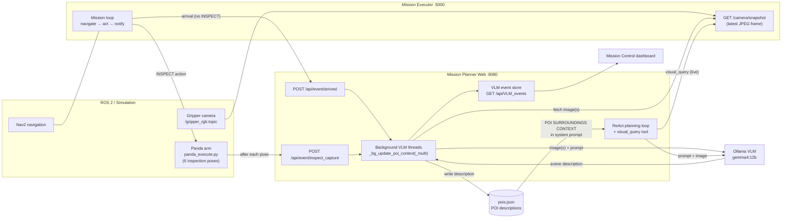

# 1. System Architecture

## Components

| Component | Process / Host | Role in VLM perception |
|-----------|----------------|------------------------|
| **Mission Executor** (`mission_executor.py`) | ROS 2 node + Flask on port **5000** | Drives the robot via Nav2, subscribes to the gripper camera (`/gripper_rgb`), serves the latest frame at `GET /camera/snapshot`, and notifies the planner when the robot arrives at a POI |
| **Mission Planner Web** (`mission_planner_web.py`) | Flask on port **8080** | Hosts the Mission Control dashboard and the ReAct planning loop; fetches camera snapshots, queries the VLM, and writes learned descriptions back into `pois.json` |
| **VLM — Gemma 4 12B via Ollama** | `http://192.168.0.125:11434/api/chat` (`OLLAMA_URL`, model `gemma4:12b`) | The vision-language model. Receives base64 JPEG images plus a text prompt via the Ollama chat API and returns a natural-language description/answer. It serves double duty as the text-only ReAct planner LLM |
| **Panda manipulator** (`panda_execute.py`) | Spawned as a subprocess during INSPECT actions | Sweeps the arm-mounted camera through 6 joint-space poses so the VLM gets multiple viewpoints of the location |
| **POI database** (`config/pois.json`) | JSON file on disk | Persistent semantic memory: each POI holds `name`, `x`, `y`, and an optional VLM-written `description` |

## Data flow

## The perception loop (closed loop)

1. **Act** — the executor navigates the robot to a POI with Nav2 and runs the stop's actions.
2. **Sense** — the gripper camera continuously publishes frames; the executor caches the
   latest one and exposes it as a JPEG snapshot.
3. **Interpret** — the planner backend sends the snapshot(s) to the Gemma 4 VLM with a
   location-specific prompt ("At location '<POI name>', list the nearby visible objects,
   landmarks, or obstacles…").
4. **Remember** — the VLM's one-sentence answer overwrites that POI's `description` in
   `pois.json` (persisted to disk via `save_pois()`), and a VLM event is pushed to the
   dashboard.
5. **Plan with it** — the next time the ReAct planner builds a mission, all stored
   descriptions are injected into its system prompt, so plans, briefings, and answers
   reflect what the robot most recently *saw*, not just the static map.

This makes environment perception **cumulative and self-updating**: every patrol or
inspection refreshes the robot's semantic memory of the visited locations.
